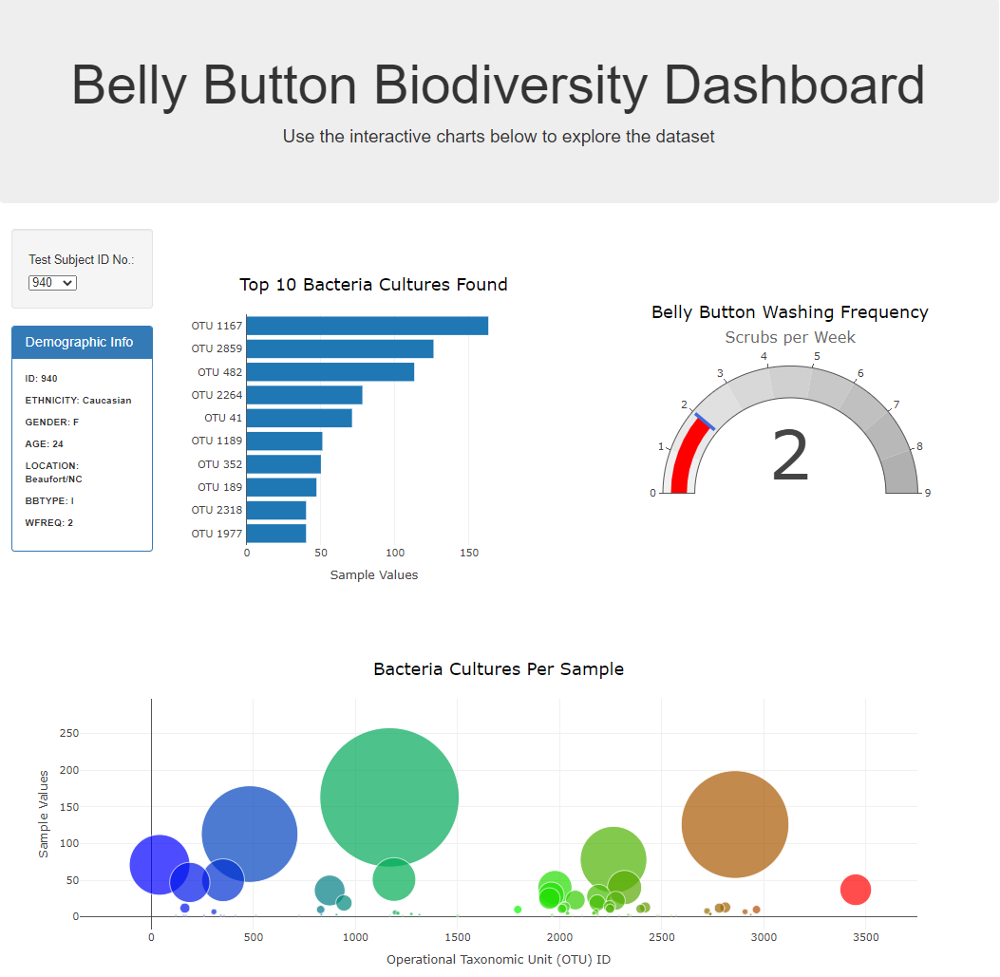

# Plotly-challenge
## Web App: Interactive dashboard for dataset exploration

### Description
The scope of this project is to build an interactive dashboard to explore the [Belly Button Biodiversity dataset](data/samples.json), which catalogs the microbes that colonize human navels. The dataset reveals that a small handful of microbial species (also called operational taxonomic units, or OTUs, in the study) were present in more than 70% of people, while the rest were relatively rare.

### Script Summary
abc

### Features

* H

### Screenshot

### [Explore the Dashboard!](https://rperezme-data.github.io/H15_Plotly-challenge/)

--- 

### References

Hulcr, J. et al.(2012) _A Jungle in There: Bacteria in Belly Buttons are Highly Diverse, but Predictable_. Retrieved from: [http://robdunnlab.com/projects/belly-button-biodiversity/results-and-data/](http://robdunnlab.com/projects/belly-button-biodiversity/results-and-data/)

--- 

**Contact:** [rperezme.data@gmail.com](mailto:rperezme.data@gmail.com)

